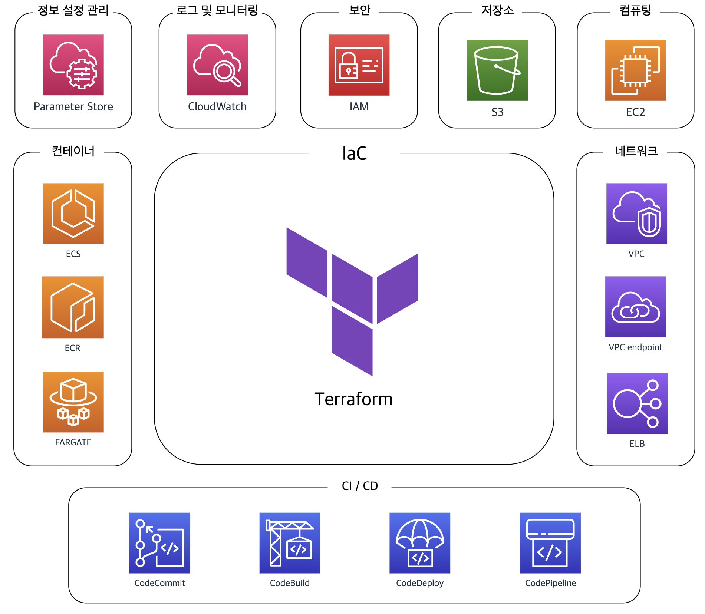
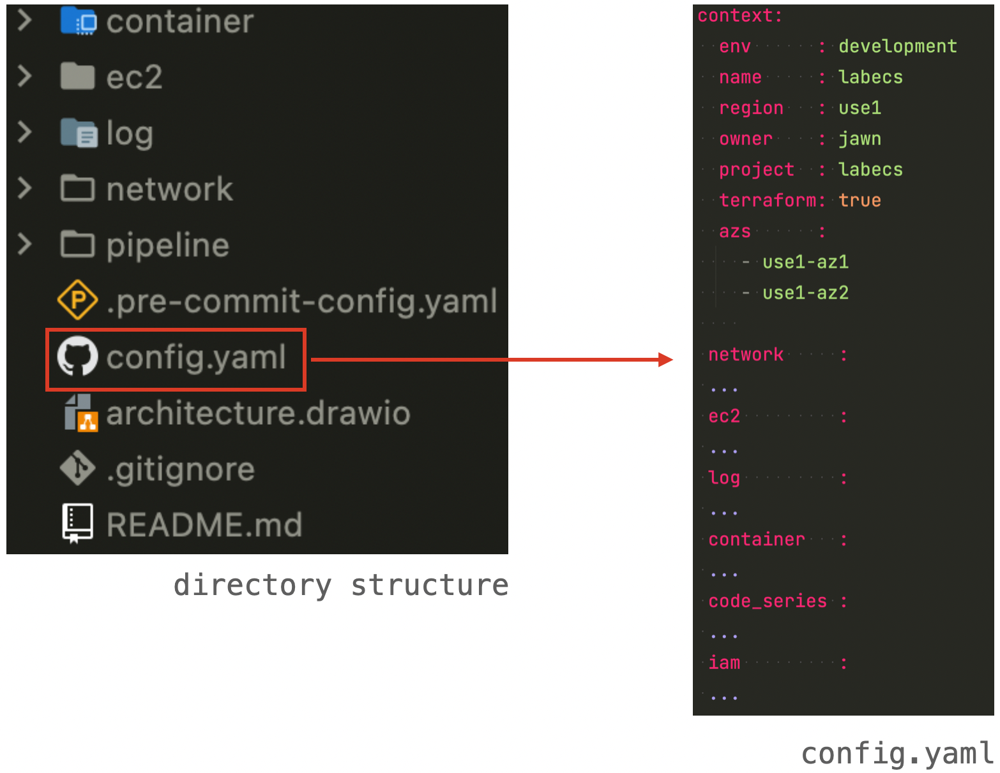
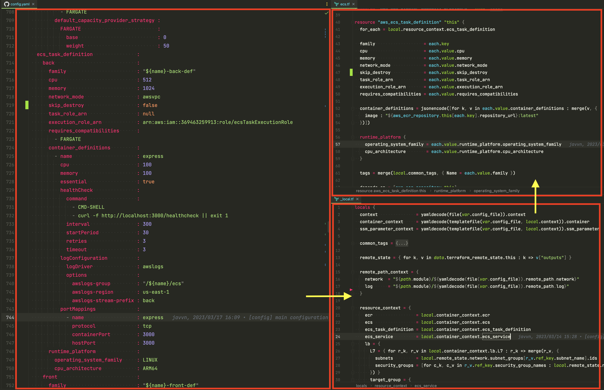
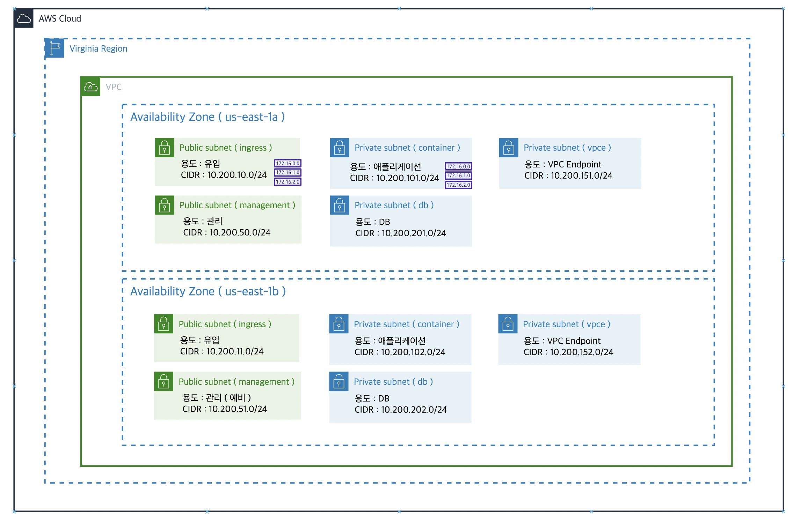
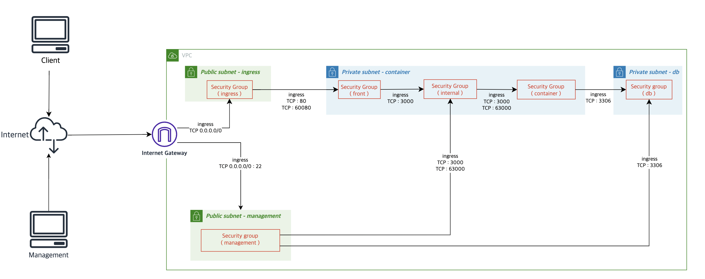
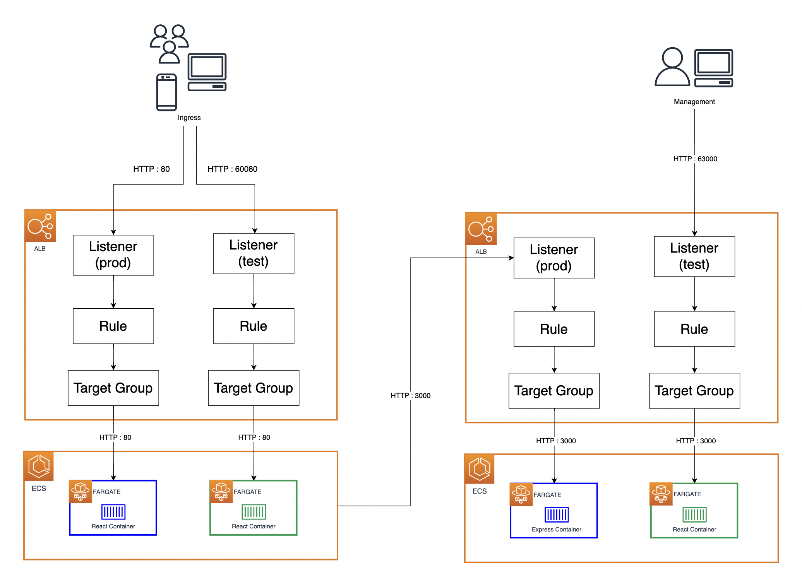
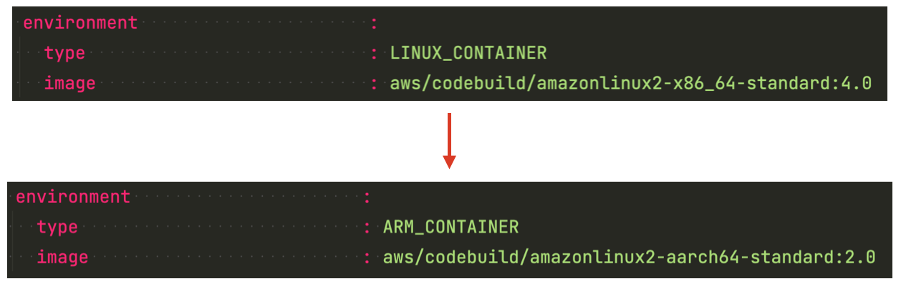
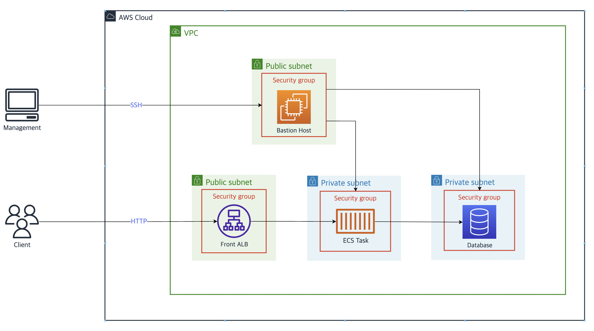
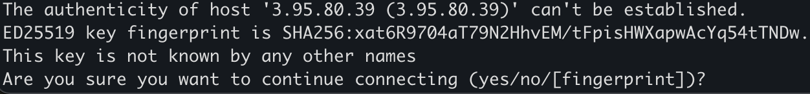
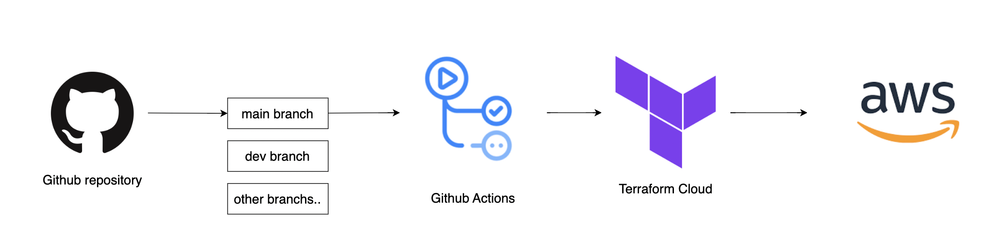

# Terraform AWS ECS Architecture

[//]: # (Building the infrastructure resources needed for a simple express web application with ECS.)

## 개요
Terraform을 이용하여 클라우드 네이티브 애플리케이션 개발을 위한 아키텍처 설계 & 구축

## 개발 인원
1명

## 목적
- Terraform을 활용한 Infra Structure 구성 및 관리
- CI/CD Pipeline 구축 및 배포 자동화
- AWS를 중심으로 컨테이너 기반 프로덕션 환경을 가정하여 Infra Structure 설계 & 구축 & 운영

## 기술 스택
- DevOps      : AWS, Terraform, Docker, Git
- Back-end    : ExpressJs
- Front-end   : ReactJs
- Programming : NodeJs, Shell script, HCL

<p align="center">
   
</p>

## 개발과정 - 코드 측면
초기에 설정 파일을 주축 서비스 중심으로 나눠놓은 디렉토리마다 배치하였다.
그러다보니 의존 컨텍스트 참조가 번거롭고 반복되는 컨텍스트가 발생하여 나눠진 설정 파일들을 루트 디렉토리로 통합하여 하나의 설정 파일로 관리할 수 있도록 구조를 변경하였다.
변경한 후 리소스에 대한 변경 사항을 각 설정 파일을 변경하지 않고 관리할 수 있어 번거로움을 줄였다.


리소스 설정 값들을 한 곳에서 명시하고, 한 눈에 파악하기 위해 코드에 대한 질서 부여하였다.
리소스 파일은 최대한 수정하지 않는 선에서 관리하고 수정이 필요한 경우 로컬 파일을 수정함으로써 리소스의 흐름을 한 곳에서 파악할 수 있다.


## 개발과정 - 인프라스트럭처 측면
### VPC, Subnet 설계


### Security Group 설계


### Container 설계

**개발 과정 중 발생한 문제**  
Back-end Express container 배포 후 HealthCheck가 동작하지 않는 것을 발견하였다.
알고보니 Base image(node:16-alpine)에 curl 패키지 설치되지 않았던 것이었다.
이에 대한 해결 방안으로 Dockerfile에 curl 패키지를 설치 명령어를 추가해줬다.

### CI / CD Pipeline 설계

**개발 과정 중 발생한 문제**

1. Docker Hub Rate Policy  
CI / CD 테스트 중 빌드 단계에서 Docker Hub 풀링 제한 이슈가 발생하였다.  
``ERROR: toomanyrequests: Too Many Requests.  
   You have reached your pull rate limit. You may increase
   the limit by authenticating and upgrading:
   https://www.docker.com/increase-rate-limits.``  
찾아보니 Docker Hub Rate Limit 정책에 관한 문제였다.  
이에 대한 해결 방안을 모색했고 안정적인 관리형 AWS 서비스인 ECR Public을 통해 Repository를 구축하였다.

위 문제를 해결하고 나니,

2. Docker Image Platform (CPU Architecture)  
   CI / CD 테스트 중 빌드 단계에서 빌드 플랫폼 호환성 문제가 발생하였다.  
   해당 빌드에 필요한 base 이미지를 로컬 환경(Macbook)으로 Pull하고 ECR Public Repository로 Push하는 과정에서 발생한 CodeBuild 상 빌드 환경과 로컬 환경 간의 호환성 문제였다.
   이에 대한 해결 방안으로 CodeBuild 상에서의 빌드 환경을 변경해주었다.


### Bastion Host 설계

**개발 과정 중 해결 사항**
EC2 인스턴스  생성 후 해당 인스턴스로 최초 SSH 접속 시 fingerprint에 대한 이슈가 발생하였다.
이로 인해 만일 하나가 아닌 인스턴스마다 fingerprint를 설정해준다면 번거롭기 때문에 어떤 작업 자동화하고자할 때 제약사항이 된다.
  
이에 대한 해결 방안으로 Terraform Null resource provisioner를 활용해 프로세스를 자동화하였다.
```hcl
resource "null_resource" "bastion" {
   triggers = {
      eip_public_ip = aws_eip.this["bastion"].public_ip
   }

   provisioner "local-exec" {
      command = "ssh-keyscan -t rsa ${aws_eip.this["bastion"].public_ip} >> ~/.ssh/known_hosts"
   }
}
```
## 개선 사항
### 인프라 자원 접근 & 제어 및 Automating Terraform
여전히 Cloud Provider UI & API로 접근 및 제어가 가능하고 이와 같은 자원에 대한 접근은 로그를 남기지 않기 때문에 추적이 불가능한 문제점이 발생한다.
따라서 합의된 Terraform 프로세스룰 생략하는 대체 인터페이스의 모든 접근을 제한해야한다.
아무도 Terraform 프로세스를 생략할 수 없으므로 코드 리뷰 절차와 Terraform workspace 권한으로 인프라 자원 수정에 대한 로그 추적이 가능해지기 때문에 인프라와 관련된 모든 것을 인식하고 제어할 수 있도록 만들어줘야 한다.
 *인프라 자원을 프로비저닝할 때 배워야하고, 안전성을 고려해야 하고, 심사해야 하는 워크플로우*
### Fluent Bit 컨테이너 사이드카 구성 및 로그 운영
기존 모든 유형의 로그들이 CloudWatch Logs로 전송되게 구축했다. 장기 보존을 위한 애플리케이션 접속로그를 S3에 보존하고 에러 로그를 CloudWatch Logs로 전송하고 싶다면 어떻게 해야할까란 의문점을 품었다. 각 컨테이너에 로그 드라이버 정의는 1개만 할 수 있는 ECS 태스크 정의 특성을 고려하여 CloudWatch Logs에서 S3로 내보내면 되지만, CloudWatch Logs는 로그 취득 시점에서 비용이 발생한다.
로그 보존 관점의 비용 최적화와 장애 시 운영을 고려 해본다면, 로그 장기 보존을 위한 애플리케이션 접속 로그를 S3로 전송하고 에러 로그를 CloudWatch Logs로 전송하도록 Fluent Bit 사이드카를 배치하는 것이 효율적이라고 판단된다.
Fluent Bit 로그 라우팅을 통해 CloudWatch Logs와 S3 양쪽에 로그 전송이 가능할 뿐 아니라 다른 AWS 서비스에 로그 전송을 용이하게 해주기 때문이다.

